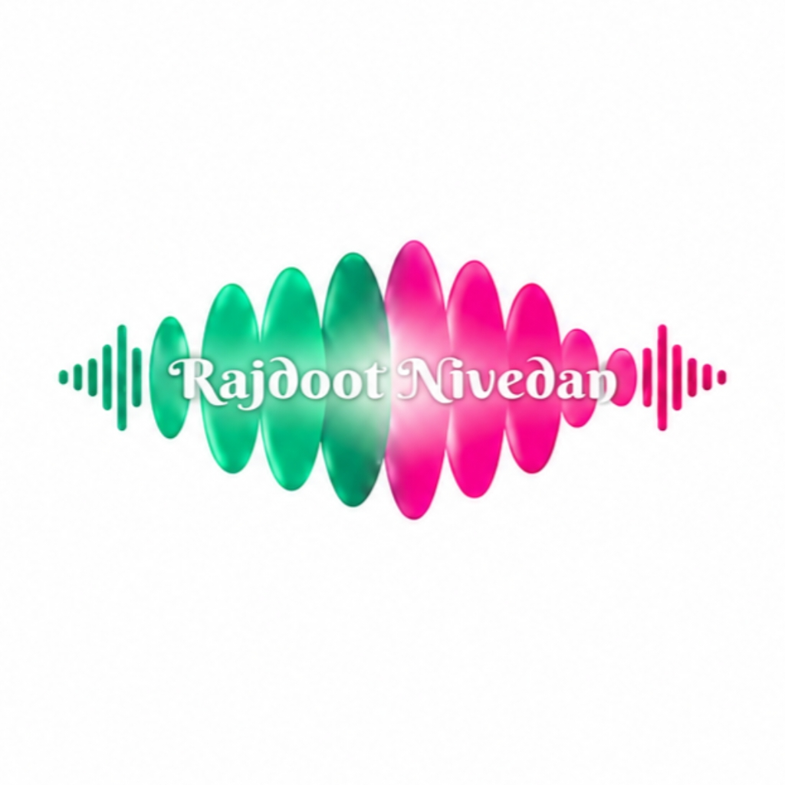

# Rajdoot Nivedan Media

<p align="center">
  
</p>

<p align="center">
  <strong>Global Music Distribution, High-Resolution Audio Management & Live Royalties Platform</strong>
</p>

<p align="center">
  
  
  
  
  
</p>

---

## 🌐 Live GitHub Pages & Overview

* **GitHub Pages Showcase**: [https://mafiurislam.github.io/Earn-Project/](https://mafiurislam.github.io/Earn-Project/)
* **Repository**: [https://github.com/mafiurislam/Earn-Project](https://github.com/mafiurislam/Earn-Project)

**Rajdoot Nivedan Media** is a modern music distribution, royalties management, and artist portal. Built with Laravel 11 and PHP 8.3, the platform offers an integrated workflow from customer song uploading to administrator review, KYC verification, payout disbursal, and catalog management.

---

## ✨ Latest Features & Capabilities

### 1. High-Resolution 3000 × 3000 PX Artwork Engine
* **Customer Uploads**: Artists and customers can upload square 3000 × 3000 px high-resolution cover artwork (JPEG, PNG, WEBP).
* **Automatic High-Fidelity Processing**: Automated GD image pipeline ensures exact 3000 × 3000 px dimensions, center cropping, and optimization.
* **Dual Storage Synchronization**: Uploaded artwork is automatically synchronized between `storage/app/public` and `public/storage`, preventing broken image icons or 404s on non-symlinked shared hosting (Hostinger, cPanel).
* **High-Res Zoom & Download**: Both the Main Admin Dashboard and Customer Portal include zoom modals and direct "Download Cover Artwork" options.

### 2. MP3 Song & Audio Management with Direct Download
* **High-Resolution Audio Streaming**: In-browser HTML5 audio player for instant playback in both Admin Console and Customer Dashboard.
* **Working Download MP3 Option**: Dedicated binary download endpoints (`route('admin.songs.download')` and `route('customer.songs.download')`) serving exact original MP3 files with proper `Content-Disposition: attachment` headers.
* **Complete Metadata Registry**: Every track stores Title, Singer/Artist, Lyrics/Composer, Producer, and automated Copyright P-Line (`℗ 2026 Rajdoot Nivedan`).

### 3. Main Admin Dashboard Catalog
* **Unified Catalog View**: Administrators can view all customer-uploaded tracks directly on the Main Admin Console.
* **Associated Customer Profiles**: Direct links to customer profiles with avatar badges and contact chips.
* **Full CRUD Management**: View high-res artwork, listen to audio, edit song details, or delete tracks with dual-storage cleanup.
* **Search & Filter**: Real-time filtering by song title, singer, composer, producer, or customer name/username/email.

### 4. KYC Verification & Document Viewer
* **PAN Card & Signature Uploads**: High-resolution KYC document inspection with full-size preview modals.
* **Approval & Rejection Flow**: One-click approval and customizable rejection reasons.

### 5. Live Earnings & Withdrawal Management
* **Flexible Balance Adjustments**: Admins can increase, decrease, or directly set customer earnings with audit logging.
* **Automated Refund upon Rejection**: Rejected withdrawals automatically credit the requested amount back to customer balances.
* **Autocart Generator Integration**: Smart automation toggle with visual indicators.

### 6. Copyright Claim Remove Links
* **10-Slot System**: Admin and customer slot management for copyright removal links.

---

## 🛠️ Technology Stack

| Layer | Technologies |
| :--- | :--- |
| **Backend Framework** | Laravel 11.x, PHP 8.3 |
| **Database** | SQLite (Zero MySQL configuration required, ultra-fast file-based DB) |
| **Frontend & UI** | Blade Templates, Bootstrap 5.3, FontAwesome 6, Custom Dark Theme CSS |
| **Image Pipeline** | PHP GD (3000 × 3000 px High-Res Resampling & Canvas Fitting) |
| **Audio Processing** | Native MPEG-3 Stream & Binary Attachment Handler |
| **Hosting Compatibility** | Apache, Hostinger Shared Hosting, cPanel, Nginx, Local PHP Dev Server |

---

## 🚀 Quick Start & Local Setup

### 1. Prerequisites
* PHP 8.3+ with `pdo_sqlite`, `gd`, `fileinfo`, `mbstring`, `openssl` extensions enabled.
* Composer installed.

### 2. Clone Repository
```bash
git clone https://github.com/mafiurislam/Earn-Project.git
cd Earn-Project
```

### 3. Environment Setup
```bash
cp .env.example .env
php artisan key:generate
```

### 4. Database Setup
```bash
touch database/database.sqlite
php artisan migrate --force
```

### 5. Launch Development Server
```bash
php artisan serve
```
Visit `http://127.0.0.1:8000` in your web browser.

---

## 📦 Hostinger / Shared Hosting Deployment

The project is pre-configured for zero-configuration deployment to Hostinger shared hosting:
* **SQLite Database**: Self-contained in `database/database.sqlite`.
* **Proc_Open Bypass**: Package discovery is pre-cached, requiring no shell access or composer scripts.
* **Root Entry Point**: [index.php](file:///c:/Users/SIMRAN/OneDrive/Desktop/Earn-Project/index.php) handles direct execution inside `public_html`.
* **Fallback Storage Route**: `/storage/{path}` fallback route handles media serving when symlinks are unsupported.

Refer to [HOSTINGER_DEPLOYMENT_GUIDE.md](file:///c:/Users/SIMRAN/OneDrive/Desktop/Earn-Project/HOSTINGER_DEPLOYMENT_GUIDE.md) for full step-by-step instructions.

---

## 🔒 Security & Data Safety

* All user passwords hashed via Bcrypt (cost 12).
* Session & CSRF protection on all forms.
* Strict authorization checks on customer audio downloads (`customer.songs.download`).
* Dual storage synchronization with directory traversal protection (`..` path sanitation).

---

## 📄 License

This software is licensed under the [MIT License](LICENSE).
Copyright © 2026 Rajdoot Nivedan Media. All Rights Reserved.
